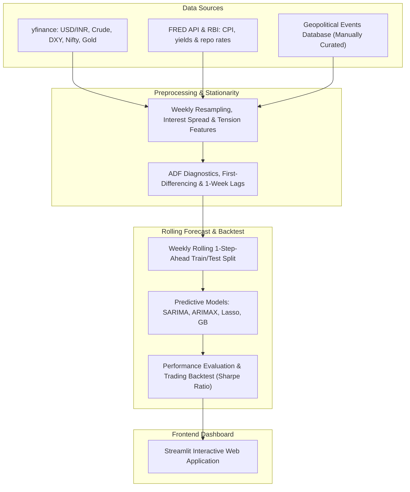

# RupeeRisk: India Macro & Geopolitical Forex Intelligence Platform

<<<<<<< HEAD
[](https://share.streamlit.io/your-username/your-repo-name/main/app.py)
=======
[](https://rupeerisk.streamlit.app)
>>>>>>> a1b335a27523ed8bb0c1bf53c2989c60145277a5

RupeeRisk is a international finance and machine learning platform that forecasts the USD/INR exchange rate by engineering geopolitical tension indicators and combining them with macroeconomic factors. 

This platform implements a statistically rigorous pipeline, compares classical econometrics against machine learning regressors, and backtests a simulated trading strategy.

---

## System Architecture & Data Flow

Below is the system architecture and data flow of the platform:



---

## The Statistical Overhaul: Avoiding Common Pitfalls

To ensure this model operates at institutional quantitative standards, the pipeline resolves two critical errors common in naive time-series models:

1. **Non-Stationarity & Spurious Regression**: Asset prices and macroeconomic levels drift over time (contain a unit root). Linear regressions fit on raw levels (e.g., USD/INR rate of 83.5 against Crude at 75.0) are mathematically invalid and lead to spurious correlation. We ran ADF tests to confirm non-stationarity in levels and stationarity in first differences.
2. **Look-Ahead Bias**: Contemporaneous forecasting (using next week's oil price to predict next week's rupee) assumes future knowledge. We lagged all exogenous variables by 1 week. To forecast the rupee's change at week t, the model only uses macro data known at week t-1.
3. **Rolling Validation**: Models are evaluated over a 52-week test set using a rolling 1-step-ahead forecast (re-fitted weekly). Predictions anchor on the previous week's actual level.

---

## Model Performance League Table (Last 52 Weeks)

Ranked out-of-sample performance over the rolling weekly test window:

| Model | MAPE (%) | RMSE | MDA (%) | Sharpe Ratio | Cumulative Return (%) |
| :--- | :---: | :---: | :---: | :---: | :---: |
| **Lasso** | **0.458%** | **0.537** | **73.08%** | **2.68** | **+11.70%** |
| **Gradient Boosting (GB)** | 0.493% | 0.552 | 65.38% | 2.36 | +10.40% |
| **ARIMAX** | 0.491% | 0.567 | 59.62% | 1.20 | +5.32% |
| **SARIMA** (Baseline) | 0.498% | 0.569 | 55.77% | 0.76 | +3.34% |
| **Random Forest (RF)** | 0.525% | 0.584 | 53.85% | -0.10 | -0.53% |

### Key Quantitative Takeaways:
- **Lasso Outperformance**: Macro drivers are highly correlated (multicollinearity). OLS/ARIMAX estimates become unstable. Lasso's L1 Regularization drives redundant coefficients to zero, achieving a phenomenal 73.08% Directional Accuracy (MDA) and a 2.68 Sharpe Ratio.
- **The Meese-Rogoff Puzzle (1983)**: The fact that SARIMA (a random walk with drift) is highly competitive out-of-sample validates standard international finance theory—exchange rates are highly efficient and difficult to beat using lagged economic variables.
- **ARIMAX beats SARIMA**: Enforcing stationarity and lagging features correctly allows ARIMAX to outperform SARIMA (MDA 59.62% vs 55.77%), proving macro indicators carry predictive signals when look-ahead bias is removed.

---

## Running the Project Locally

### 1. Installation
Clone the repository and install dependencies inside a virtual environment:
```bash
python -m venv .venv
source .venv/bin/activate  # On Windows: .venv\Scripts\activate
pip install -r requirements.txt
```

### 2. Execute Data & Models
Run the notebooks in order:
1. `notebooks/01_data_collection.ipynb` (fetches Yahoo Finance and FRED series)
2. `notebooks/02_eda_features.ipynb` (feature engineering and ADF tests)
3. `notebooks/02b_seasonal_analysis.ipynb` (STL seasonal decomposition)
4. `notebooks/03_event_study.ipynb` (quantifies asset responses to geopolitical shocks)
5. `notebooks/04_forecasting.ipynb` (runs rolling forecast models and backtests)

*Alternatively, you can run all notebooks using nbconvert:*
```bash
jupyter nbconvert --to notebook --execute --inplace notebooks/*.ipynb
```

### 3. Launch App
Start the interactive Streamlit dashboard:
```bash
streamlit run app.py
```

---

## Project Structure
- `data/`: Contains raw downloaded datasets and processed outputs (correlation matrix, model predictions, backtest returns).
- `notebooks/`: Modular notebooks containing the research, data collection, EDA, econometrics, and modeling code.
- `app.py`: The interactive multi-tab Streamlit dashboard.
- `requirements.txt`: Project package dependencies.
- `README.md`: Project summary documentation.
