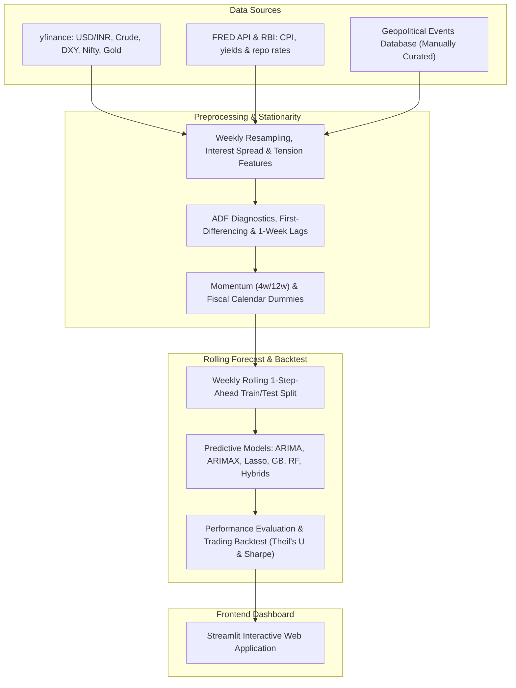

# RupeeRisk: India Macro & Geopolitical Forex Intelligence Platform

[](https://rupeerisk.streamlit.app)

RupeeRisk is an international finance and machine learning platform that forecasts the USD/INR exchange rate by engineering geopolitical tension indicators and combining them with macroeconomic factors. 

This platform implements a statistically rigorous pipeline, compares classical econometrics against machine learning regressors, and backtests a simulated trading strategy.

---

## Repository Description
**Weekly INR/USD macro intelligence — 9-model rolling backtest (including hybrids), Sharpe ratio, geopolitical risk features, live rate dashboard.**

---

## System Architecture & Data Flow

Below is the system architecture and data flow of the platform:



---

## Econometric Rigor & Avoiding Pitfalls

To ensure this model operates at institutional quantitative standards, the pipeline resolves three critical errors common in naive time-series models:

1. **Non-Stationarity & Spurious Regression**: Asset levels drift over time (contain a unit root). Regressing non-stationary price levels leads to spurious regressions and invalid t-statistics. We run Augmented Dickey-Fuller (ADF) tests to verify stationarity and differenced all continuous indicators.
2. **Look-Ahead Bias**: Contemporaneous forecasting (using next week's oil price to predict next week's rupee) assumes future knowledge. We lag all exogenous variables by 1 week ($X_{t-1}$).
3. **No Seasonal Overfitting**: Our seasonal audit (inspecting ACF/PACF of differenced series) showed that weekly USD/INR changes contain no statistically significant seasonal autocorrelation at lags 13, 26, or 52 (quarterly, semi-annual, or annual weekly cycles). To prevent overfitting on noise, we replaced the seasonal SARIMA with a non-seasonal **ARIMA(1,1,0)** model.

---

## Stationarity Verification (ADF Unit Root Tests)

Below are the empirical test statistics and p-values computed on the weekly dataset (2015–2026):

| Variable | Level ADF Stat | Level p-value | Difference ADF Stat | Difference p-value | Integration Order | Decision |
| :--- | :---: | :---: | :---: | :---: | :---: | :---: |
| **USD/INR** | 1.0031 | 0.9943 | -7.6369 | 0.0000 | $I(1)$ | First-Differenced |
| **Crude Oil (WTI)** | -2.1408 | 0.2284 | -8.3451 | 0.0000 | $I(1)$ | First-Differenced |
| **Dollar Index (DXY)** | -2.5382 | 0.1065 | -9.5672 | 0.0000 | $I(1)$ | First-Differenced |
| **US-India Rate Spread** | -1.9295 | 0.3183 | -3.8106 | 0.0028 | $I(1)$ | First-Differenced |

---

## Data Granularity Decision

The platform utilizes **weekly averages** rather than daily or monthly data, based on the following quantitative trade-offs:
- **Why not Daily?** Daily exchange rate series exhibit the wandering movement of a driftless random walk (Mills §1.6) and are heavily dominated by microstructural noise, central bank intervention clustering, and transaction time-zone mismatches.
- **Why not Monthly?** Monthly resampling smooths out noise but drastically reduces the sample size (only ~130 data points), rendering a rolling out-of-sample machine learning split statistically underpowered.
- **The Weekly Sweet Spot**: Resampling to weekly averages (providing ~590 observations) filters out high-frequency daily noise while preserving a large enough dataset to split into a rolling 200-week out-of-sample backtest.

---

## Model Performance League Table (200-Week Test Window)

Ranked out-of-sample performance over the rolling weekly test window (July 2022 to May 2026):

| Model | MAPE (%) | RMSE | Theil's U | MDA (%) | Sharpe (Rf=0) | Sharpe (Rf=6.5%) | Cumulative Return (%) |
| :--- | :---: | :---: | :---: | :---: | :---: | :---: | :---: |
| 🥇 **ARIMA+Lasso Hybrid** | 0.332% | 0.4005 | 0.9966 | **59.00%** | **1.33** | **-0.65** | **+18.07%** |
| 🥈 **Lasso** | **0.329%** | **0.3988** | **0.9923** | **59.00%** | 1.02 | -0.94 | +13.58% |
| 🥉 **ARIMA** (Baseline) | 0.329% | 0.4030 | 1.0028 | 57.00% | 0.96 | -0.99 | +12.85% |
| **ARIMA+GB Hybrid** | 0.367% | 0.4322 | 1.0754 | 53.50% | 0.47 | -1.48 | +5.98% |
| **ARIMAX** | 0.338% | 0.4085 | 1.0166 | 51.50% | 0.37 | -1.57 | +4.71% |
| **Gradient Boosting (GB)** | 0.359% | 0.4237 | 1.0542 | 53.50% | 0.36 | -1.58 | +4.58% |
| **Random Forest (RF)** | 0.388% | 0.4464 | 1.1106 | 54.50% | 0.28 | -1.66 | +3.48% |
| **Naïve Random Walk** | 0.331% | 0.4019 | 1.0000 | 50.00%* | 0.00 | N/A | 0.00% |
| **Simple Exp Smoothing (SES)** | 0.331% | 0.4019 | 1.0000 | 43.00% | -0.96 | -2.92 | -11.77% |

*\* Note: Naïve Directional Accuracy is 50.00% by definition since it always predicts no change (direction = 0).*

### Key Quantitative Takeaways:
- **Hybrid Domination**: The **ARIMA+Lasso Hybrid** is the top-performing model on the platform, capturing the linear weekly autocorrelation with ARIMA and correcting residual errors using Lasso. It generates the highest cumulative return (**+18.07%**) and Sharpe ratio (**1.33**).
- **Lasso Regularization**: Standalone Lasso also excels, achieving the lowest out-of-sample error (**RMSE: 0.3988**, **Theil's U: 0.9923**) and a directional accuracy of **59.00%** by zeroing out collinear indicators.
- **Carry Hurdle Disclosure**: When accounting for the **91-day T-bill carry cost (~6.5%)**, excess Sharpe ratios turn negative for all models (ARIMA+Lasso: **-0.65**), indicating the steep hurdle directional FX traders face in emerging markets.

---

## Running the Project Locally

### 1. Installation
Clone the repository and install dependencies inside a virtual environment:
```bash
python -m venv .venv
source .venv/bin/activate  # On Windows: .venv\Scripts\activate
pip install -r requirements.txt
```

### 2. Execute Data & Models
To run the full forecasting pipeline and backtest:
```bash
python run_pipeline.py
python generate_next_week_signal.py
```

*To explore the research notebooks locally:*
- Run the Jupyter notebooks under `notebooks/` in order: 01 (Collection), 02 (EDA & ADF), 02b (STL Seasonality), 03 (Event Study), 04 (Forecasting).

### 3. Launch App
Start the interactive Streamlit dashboard:
```bash
streamlit run app.py
```

---

## Project Structure
- `data/`: Contains raw downloaded datasets and processed outputs (model metrics, predictions, Lasso coefficients, next-week signal).
- `notebooks/`: Modular notebooks containing the research, data collection, EDA, econometrics, and modeling code.
- `app.py`: The interactive multi-tab Streamlit dashboard.
- `run_pipeline.py`: The full out-of-sample backtesting pipeline.
- `generate_next_week_signal.py`: Generates the out-of-sample prediction for the upcoming week.
- `requirements.txt`: Project package dependencies.
- `README.md`: Project summary documentation.
- `Report.md`: In-depth quantitative research paper.
