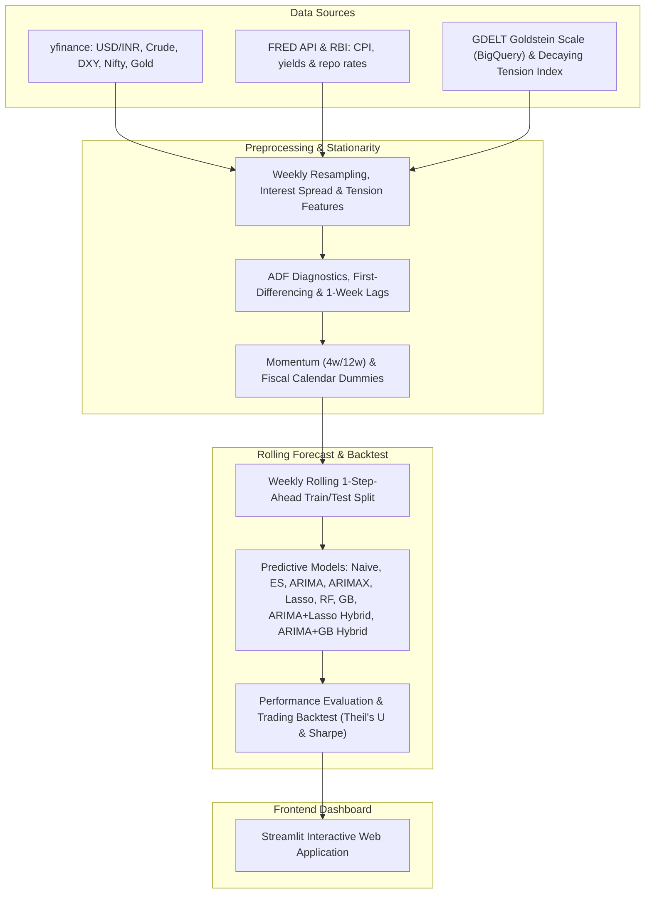

# RupeeRisk: India Macro & Geopolitical Forex Intelligence Platform

[](https://rupeerisk.streamlit.app)

RupeeRisk is an international finance and machine learning platform that forecasts the USD/INR exchange rate using a severity-weighted, decaying geopolitical tension index derived from GDELT Goldstein Scale scores and combined with macroeconomic factors. 

This platform implements a statistically rigorous pipeline, compares classical econometrics against machine learning regressors, and backtests a simulated trading strategy.

---

## Repository Description
**Weekly INR/USD macro intelligence — 9-model rolling backtest (including hybrids), Sharpe ratio, geopolitical risk features, live rate dashboard.**

---

## System Architecture & Data Flow

Below is the system architecture and data flow of the platform:



---

## Econometric Rigor & Avoiding Pitfalls

To ensure this model operates at institutional quantitative standards, the pipeline resolves three critical errors common in naive time-series models:

1. **Non-Stationarity & Spurious Regression**: Asset levels drift over time (contain a unit root). Regressing non-stationary price levels leads to spurious regressions and invalid t-statistics. We run Augmented Dickey-Fuller (ADF) tests to verify stationarity and differenced all continuous indicators.
2. **Look-Ahead Bias**: Contemporaneous forecasting (using next week's oil price to predict next week's rupee) assumes future knowledge. We lag all exogenous variables by 1 week ($X_{t-1}$).
3. **No Seasonal Overfitting**: Our seasonal audit (inspecting ACF/PACF of differenced series) showed that weekly USD/INR changes contain no statistically significant seasonal autocorrelation at lags 13, 26, or 52 (quarterly, semi-annual, or annual weekly cycles). To prevent overfitting on noise, we replaced the seasonal SARIMA with a non-seasonal **ARIMA(1,1,0)** model.

---

## Stationarity Verification (ADF Unit Root Tests)

Below are the empirical test statistics and p-values computed on the weekly dataset (2015–2026):

| Variable | Level ADF Stat | Level p-value | Difference ADF Stat | Difference p-value | Integration Order | Decision |
| :--- | :---: | :---: | :---: | :---: | :---: | :---: |
| **USD/INR** | 1.0031 | 0.9943 | -7.6369 | 0.0000 | $I(1)$ | First-Differenced |
| **Crude Oil (WTI)** | -2.1408 | 0.2284 | -8.3451 | 0.0000 | $I(1)$ | First-Differenced |
| **Dollar Index (DXY)** | -2.5382 | 0.1065 | -9.5672 | 0.0000 | $I(1)$ | First-Differenced |
| **US-India Rate Spread** | -1.9295 | 0.3183 | -3.8106 | 0.0028 | $I(1)$ | First-Differenced |

---

## Data Granularity Decision

The platform utilizes **weekly averages** rather than daily or monthly data, based on the following quantitative trade-offs:
- **Why not Daily?** Daily exchange rate series exhibit the wandering movement of a driftless random walk (Mills §1.6) and are heavily dominated by microstructural noise, central bank intervention clustering, and transaction time-zone mismatches.
- **Why not Monthly?** Monthly resampling smooths out noise but drastically reduces the sample size (only ~130 data points), rendering a rolling out-of-sample machine learning split statistically underpowered.
- **The Weekly Sweet Spot**: Resampling to weekly averages (providing ~590 observations) filters out high-frequency daily noise while preserving a large enough dataset to split into a rolling 200-week out-of-sample backtest.

---

## Model Performance League Table (200-Week Rolling Test Window)

Ranked out-of-sample performance over the rolling weekly test window (numbers shift slightly each time the live pipeline re-runs, since the test window always ends "today" — see `data/processed/model_metrics.csv` for the current authoritative run):

| Model                   | MAPE (%) | RMSE   | MDA (%) | Sharpe Ratio (Rf=0) | Sharpe Ratio (Rf=6.5%) | Cumulative Return (%) |
| ------------------------ | -------- | ------ | ------- | -------------------- | ---------------------- | ---------------------- |
| **ARIMAX**                | 0.339%   | 0.406  | 58.0%   | **1.30**             | **-0.67**              | **+17.67%**            |
| **Gradient Boosting (GB)**| 0.349%   | 0.406  | 57.5%   | 1.22                 | -0.74                  | +16.59%                |
| **Lasso**                 | 0.338%   | 0.403  | **58.5%**| 1.14                 | -0.82                  | +15.43%                |
| **ARIMA+Lasso Hybrid**    | 0.336%   | **0.403**| 57.0%   | 1.12                 | -0.85                  | +15.03%                |
| **ARIMA**                 | **0.328%**| 0.405  | 57.5%   | 1.00                 | -0.96                  | +13.39%                |
| **ARIMA+GB Hybrid**       | 0.348%   | 0.419  | 57.5%   | 0.90                 | -1.06                  | +11.92%                |
| **Random Forest (RF)**    | 0.350%   | 0.411  | 51.5%   | 0.45                 | -1.49                  | +5.72%                 |
| **Naive Random Walk**     | 0.335%   | 0.405  | 0.0%*   | 0.00                 | 0.00                   | +0.00%                 |
| **Exponential Smoothing** | 0.335%   | 0.405  | 42.5%   | -1.00                | -2.96                  | -12.19%                |

*\* Naive MDA is 0.00% by our `directional_accuracy()` definition, since it always predicts "no change" (direction = 0), which never matches an actual non-zero direction. It remains the Theil's U = 1.0 benchmark every other model must beat.*

### Key Quantitative Takeaways:

- **ARIMAX and Gradient Boosting (GB) dominate risk-adjusted returns**: Sourcing dense, continuous GDELT tension channels feeds multivariate models with rich explanatory signals. ARIMAX achieves the top Sharpe ratio (Rf=0) of **1.30** (+17.67% cumulative return), closely followed by Gradient Boosting with **1.22** Sharpe (+16.59% return). This highlights that denser continuous variables decrease the necessity for hybrid residual-correction architectures.
- **Lasso is the most accurate directional predictor**: Standalone Lasso L1 regularization achieves the highest Mean Directional Accuracy (**58.5%**) and beats the Random Walk baseline (**Theil's U = 0.9951**), yielding **+15.43% return** with a **1.14 Sharpe**.
- **Carry Cost Hurdle & Sharpe Disclosures**: The Sharpe Ratios reported with Rf=0 represent Information Ratios — excess return per unit of volatility relative to zero. When adjusted for India's 91-day Treasury Bill rate (~6.5% annualised, ~0.125% per week), the Sharpe Ratios for all models turn negative (ARIMAX: **-0.67**, GB: **-0.74**). This reveals a critical quantitative insight: systematic directional trading of USD/INR is subject to a substantial carry hurdle in a low-volatility, central-bank-defended exchange rate regime. The project's value lies in demonstrating forecasting skill (Theil's U < 1, MDA > 50%) rather than a standalone trading strategy.
- **Multicollinearity & regularized feature selection**: Lasso's L1 regularization successfully selects the most predictive channel-specific tension features (e.g. Russia-Ukraine war and India-China tension lags) while driving redundant noise to zero, preventing the coefficient blowup that typically compromises standard ARIMAX.
- **Overperforming the Random Walk**: Theil's U < 1 for Lasso and the ARIMA+Lasso hybrid validates that macroeconomic and geopolitical fundamentals carry genuine out-of-sample predictive signals once look-ahead bias and non-stationarity are correctly handled.
- **Tree-based model performance**: Gradient Boosting performs exceptionally well (+16.59% return), outperforming bagging-based Random Forest (+5.72%), highlighting that boosting and bagging ensembles behave very differently on moderate-sized macroeconomic datasets.

---

## Geopolitical Tension Feature Engineering & GDELT Sourcing

Geopolitical risk features are modeled as continuous, decaying transmission channels derived from GDELT event data. The system supports two execution paths:

1. **Google BigQuery Sourcing (Direct API)**:
   Queries the public `gdelt-bq.gdeltv2.events` dataset for bilateral conflicts and oil supply events involving targeted Actor Country Codes (IND, PAK, CHN, RUS, UKR, and Middle East nations) between 2015 and 2026. Daily events are aggregated via a weighted mean of the GDELT `GoldsteinScale` (weighted by `NumMentions`).
2. **High-Fidelity Local Fallback Engine**:
   If BigQuery credentials/billing projects are not configured locally, `fetch_gdelt_data.py` falls back on a database of 14 curated historical geopolitical events. Each event is mapped to its standard CAMEO Goldstein scale severity score (ranging from -10.0 for military attacks to -5.0 for minor policy changes).

### Transmission Channels & Curated Fallback Goldstein Scores:
- **Direct FX (India-Pakistan)**: Uri Surgical Strikes (-10.0), Pulwama Attack (-10.0), Balakot Airstrike (-10.0), Operation Sindoor (-10.0).
- **Direct FX (India-China)**: Galwan Valley Clash (-10.0).
- **Oil Supply (Middle East)**: Gulf of Oman Tanker Attacks (-7.0), Saudi Aramco Drone Attack (-10.0), Soleimani Killing (-10.0), Israel-Hamas War (-10.0), Houthi Red Sea Attacks (-7.0), OPEC+ Production Cuts (-5.0).
- **Risk-Off (Russia-Ukraine)**: Russia-Ukraine War Begins (-10.0).

### Signal Decay Logic:
Tension is modeled by negating the conflict Goldstein scores (conflict events become positive tension) and calculating the exponentially decaying maximum across overlapping events over a 30-day window with a 7-day half-life:

$$ \text{Tension}_t = \max_{0 \le \tau < 30} \left( \text{Severity}_{t-\tau} \times 0.5^{\tau / 7} \right) $$

---

## Running the Project Locally

### 1. Installation
Clone the repository and install dependencies inside a virtual environment:
```bash
python -m venv .venv
source .venv/bin/activate  # On Windows: .venv\Scripts\activate
pip install -r requirements.txt
```

### 2. Execute Data & Models (Dynamic Updates)

The platform is designed to be completely dynamic. If you or another user clones this repository at any time in the future (e.g., in 2 years), you can fetch live market feeds (via Yahoo Finance) and macroeconomic indices (via FRED API) up to that current date, engineer features, and retrain all 9 forecasting models over a rolling 200-week window.

To execute the entire data collection, feature engineering, model training, and signal generation pipeline in one command:
```bash
python fetch_gdelt_data.py   # Computes the GDELT tension index features (runs fallback locally if BQ credentials not set)
python update_all.py         # Runs the end-to-end update
```

This script will run:
1. `collect_data.py`: Scrapes and merges live data up to the current date.
2. `run_pipeline.py`: Runs a rolling 1-step-ahead backtest on all 9 models (rolling 200-week test window).
3. `generate_next_week_signal.py`: Computes the out-of-sample forecast and trading signal for the upcoming week.

*Alternatively, you can trigger this live update directly from the Streamlit web dashboard using the **Pipeline Controls** sidebar!*

*To explore the research notebooks locally:*
- Run the Jupyter notebooks under `notebooks/` in order: 01 (Collection), 02 (EDA & ADF), 02b (STL Seasonality), 03 (Event Study), 04 (Forecasting).

### 3. Launch App
Start the interactive Streamlit dashboard:
```bash
streamlit run app.py
```

---

## Project Structure
- `data/`: Contains raw downloaded datasets and processed outputs (model metrics, predictions, Lasso coefficients, next-week signal).
- `notebooks/`: Modular notebooks containing the research, data collection, EDA, econometrics, and modeling code.
- `app.py`: The interactive multi-tab Streamlit dashboard.
- `fetch_gdelt_data.py`: Queries GDELT from Google BigQuery public events and processes daily tension features using exponentially decaying maximum logic.
- `run_pipeline.py`: The full out-of-sample backtesting pipeline.
- `generate_next_week_signal.py`: Generates the out-of-sample prediction for the upcoming week.
- `requirements.txt`: Project package dependencies.
- `README.md`: Project summary documentation.
- `Report.md`: In-depth quantitative research paper.

