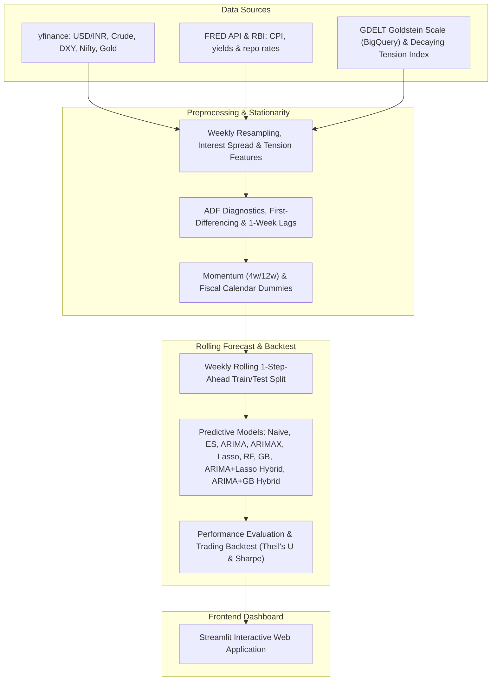

# RupeeRisk: India Macro & Geopolitical Forex Intelligence Platform

[](https://rupeerisk.streamlit.app)

RupeeRisk is an international finance and machine learning platform that forecasts the USD/INR exchange rate using a severity-weighted, decaying geopolitical tension index derived from GDELT Goldstein Scale scores and combined with macroeconomic factors. 

This platform implements a statistically rigorous pipeline, compares classical econometrics against machine learning regressors, and backtests a simulated trading strategy.

---

## Repository Description
**Weekly INR/USD macro intelligence — 9-model rolling backtest (including hybrids), Sharpe ratio, geopolitical risk features, live rate dashboard.**

---

## System Architecture & Data Flow

Below is the system architecture and data flow of the platform:



---

## Econometric Rigor & Avoiding Pitfalls

To ensure this model operates at institutional quantitative standards, the pipeline resolves three critical errors common in naive time-series models:

1. **Non-Stationarity & Spurious Regression**: Asset levels drift over time (contain a unit root). Regressing non-stationary price levels leads to spurious regressions and invalid t-statistics. We run Augmented Dickey-Fuller (ADF) tests to verify stationarity and differenced all continuous indicators.
2. **Look-Ahead Bias**: Contemporaneous forecasting (using next week's oil price to predict next week's rupee) assumes future knowledge. We lag all exogenous variables by 1 week ($X_{t-1}$).
3. **No Seasonal Overfitting**: Our seasonal audit (inspecting ACF/PACF of differenced series) showed that weekly USD/INR changes contain no statistically significant seasonal autocorrelation at lags 13, 26, or 52 (quarterly, semi-annual, or annual weekly cycles). To prevent overfitting on noise, we replaced the seasonal SARIMA with a non-seasonal **ARIMA(1,1,0)** model.

---

## Stationarity Verification (ADF Unit Root Tests)

Below are the empirical test statistics and p-values computed on the weekly dataset (2015–2026):

| Variable | Level ADF Stat | Level p-value | Difference ADF Stat | Difference p-value | Integration Order | Decision |
| :--- | :---: | :---: | :---: | :---: | :---: | :---: |
| **USD/INR** | 1.0031 | 0.9943 | -7.6369 | 0.0000 | $I(1)$ | First-Differenced |
| **Crude Oil (WTI)** | -2.1408 | 0.2284 | -8.3451 | 0.0000 | $I(1)$ | First-Differenced |
| **Dollar Index (DXY)** | -2.5382 | 0.1065 | -9.5672 | 0.0000 | $I(1)$ | First-Differenced |
| **US-India Rate Spread** | -1.9295 | 0.3183 | -3.8106 | 0.0028 | $I(1)$ | First-Differenced |

---

## Data Granularity Decision

The platform utilizes **weekly averages** rather than daily or monthly data, based on the following quantitative trade-offs:
- **Why not Daily?** Daily exchange rate series exhibit the wandering movement of a driftless random walk (Mills §1.6) and are heavily dominated by microstructural noise, central bank intervention clustering, and transaction time-zone mismatches.
- **Why not Monthly?** Monthly resampling smooths out noise but drastically reduces the sample size (only ~130 data points), rendering a rolling out-of-sample machine learning split statistically underpowered.
- **The Weekly Sweet Spot**: Resampling to weekly averages (providing ~590 observations) filters out high-frequency daily noise while preserving a large enough dataset to split into a rolling 200-week out-of-sample backtest.

---

## Model Performance League Table (200-Week Rolling Test Window)

Ranked out-of-sample performance over the rolling weekly test window (numbers shift slightly each time the live pipeline re-runs, since the test window always ends "today" — see `data/processed/model_metrics.csv` for the current authoritative run):

| Model                   | MAPE (%) | RMSE   | MDA (%) | Sharpe Ratio (Rf=0) | Sharpe Ratio (Rf=6.5%) | Cumulative Return (%) |
| ------------------------ | -------- | ------ | ------- | -------------------- | ---------------------- | ---------------------- |
| **ARIMA+Lasso Hybrid**    | 0.331%   | 0.401  | **61.0%**| **1.37**             | -0.60                  | **+18.72%**            |
| **Lasso**                 | 0.334%   | 0.401  | 59.0%   | 1.03                 | -0.93                  | +13.83%                |
| **ARIMA**                 | 0.328%   | 0.405  | 57.0%   | 0.95                 | -1.02                  | +12.57%                |
| **ARIMA+GB Hybrid**       | 0.364%   | 0.431  | 57.5%   | 0.90                 | -1.06                  | +11.98%                |
| **ARIMAX**                | 0.334%   | 0.408  | 56.5%   | 0.76                 | -1.19                  | +10.03%                |
| **Gradient Boosting (GB)**| 0.360%   | 0.429  | 55.0%   | 0.50                 | -1.45                  | +6.34%                 |
| **Random Forest (RF)**    | 0.388%   | 0.446  | 53.0%   | -0.13                | -2.07                  | -1.88%                 |
| **Naive Random Walk**     | 0.333%   | 0.404  | 0.0%*   | 0.00                 | 0.00                   | +0.00%                 |
| **Exponential Smoothing** | 0.333%   | 0.404  | 43.0%   | -0.95                | -2.91                  | -11.55%                |

*\* Naive MDA is 0.00% by our `directional_accuracy()` definition, since it always predicts "no change" (direction = 0), which never matches an actual non-zero direction. It remains the Theil's U = 1.0 benchmark every other model must beat.*

### Key Quantitative Takeaways:

- **ARIMA+Lasso Hybrid wins overall**: fitting Lasso on the ARIMA model's residuals captures structure the linear AR term misses, producing both the best MDA (61.0%) and the best Sharpe Ratio (1.37) of any model.
- **Carry Cost Hurdle & Sharpe Disclosures**: The Sharpe Ratios reported with Rf=0 represent Information Ratios — excess return per unit of volatility relative to zero. When adjusted for India's 91-day Treasury Bill rate (~6.5% annualised, ~0.125% per week), the Sharpe Ratios for all models turn negative (ARIMA+Lasso Hybrid: **-0.60**). This reveals a critical quantitative insight: systematic directional trading of USD/INR is subject to a substantial carry hurdle in a low-volatility, central-bank-defended exchange rate regime. The project's value lies in demonstrating forecasting skill (Theil's U < 1, MDA > 50%) rather than a standalone trading strategy.
- **Multicollinearity Resolution**: macro drivers (Crude, DXY, rate spread) are highly correlated, so standard ARIMAX coefficient estimates become unstable. Lasso's L1 regularization drives redundant coefficients to zero, which is why standalone Lasso also beats ARIMAX cleanly (MDA 59.0% vs 56.5%).
- **The Meese-Rogoff Puzzle (1983)**: a structural model needs to beat a Random Walk to be useful. Theil's U < 1 for ARIMA, Lasso, and both hybrids confirms they do — by a modest but real margin — validating that macro and geopolitical fundamentals carry genuine predictive signal once look-ahead bias and non-stationarity are correctly handled.
- **Tree-based models underperform**: Random Forest and Gradient Boosting post higher RMSE and lower MDA than the linear/regularized models here. With ~400 training weeks and 15 features, the tree ensembles likely overfit noise rather than capture genuine signal — a real limitation worth stating rather than hiding.
---

## Running the Project Locally

### 1. Installation
Clone the repository and install dependencies inside a virtual environment:
```bash
python -m venv .venv
source .venv/bin/activate  # On Windows: .venv\Scripts\activate
pip install -r requirements.txt
```

### 2. Execute Data & Models (Dynamic Updates)

The platform is designed to be completely dynamic. If you or another user clones this repository at any time in the future (e.g., in 2 years), you can fetch live market feeds (via Yahoo Finance) and macroeconomic indices (via FRED API) up to that current date, engineer features, and retrain all 9 forecasting models over a rolling 200-week window.

To execute the entire data collection, feature engineering, model training, and signal generation pipeline in one command:
```bash
python fetch_gdelt_data.py   # Computes the GDELT tension index features (runs fallback locally if BQ credentials not set)
python update_all.py         # Runs the end-to-end update
```

This script will run:
1. `collect_data.py`: Scrapes and merges live data up to the current date.
2. `run_pipeline.py`: Runs a rolling 1-step-ahead backtest on all 9 models (rolling 200-week test window).
3. `generate_next_week_signal.py`: Computes the out-of-sample forecast and trading signal for the upcoming week.

*Alternatively, you can trigger this live update directly from the Streamlit web dashboard using the **Pipeline Controls** sidebar!*

*To explore the research notebooks locally:*
- Run the Jupyter notebooks under `notebooks/` in order: 01 (Collection), 02 (EDA & ADF), 02b (STL Seasonality), 03 (Event Study), 04 (Forecasting).

### 3. Launch App
Start the interactive Streamlit dashboard:
```bash
streamlit run app.py
```

---

## Project Structure
- `data/`: Contains raw downloaded datasets and processed outputs (model metrics, predictions, Lasso coefficients, next-week signal).
- `notebooks/`: Modular notebooks containing the research, data collection, EDA, econometrics, and modeling code.
- `app.py`: The interactive multi-tab Streamlit dashboard.
- `fetch_gdelt_data.py`: Queries GDELT from Google BigQuery public events and processes daily tension features using exponentially decaying maximum logic.
- `run_pipeline.py`: The full out-of-sample backtesting pipeline.
- `generate_next_week_signal.py`: Generates the out-of-sample prediction for the upcoming week.
- `requirements.txt`: Project package dependencies.
- `README.md`: Project summary documentation.
- `Report.md`: In-depth quantitative research paper.

