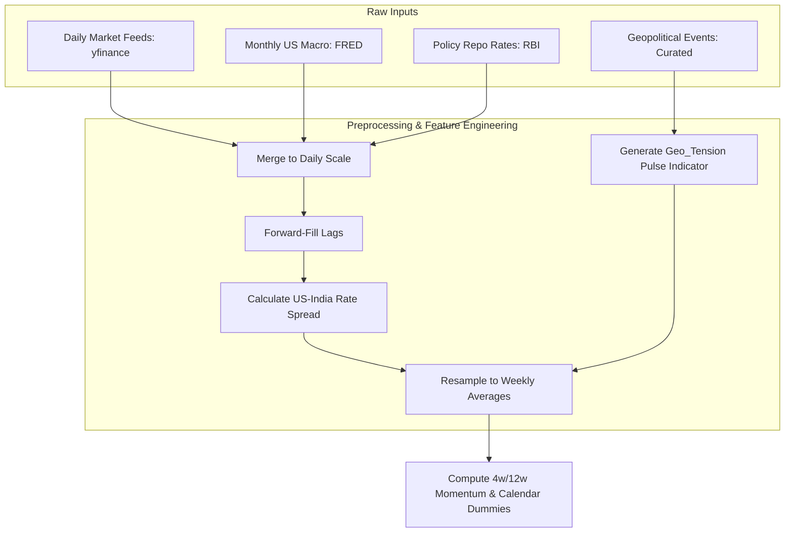

# Quantitative Research Report: Geopolitical Risk & Macroeconomic Drivers in USD/INR Exchange Rate Forecasting

**Author**: Srishti Lamba  
**Institution**: M.Sc. Data Science, DAU  
**Date**: June 2026  

---

## 1. Executive Summary
This research paper presents a statistically rigorous, machine-learning-driven framework to forecast the USD/INR exchange rate at a **weekly frequency** using data from 2015 to 2026. Exchange rate forecasting in emerging markets is famously challenging due to non-stationarity, multicollinearity among macro variables, and sudden geopolitical shocks. 

By engineering a custom **Geopolitical Tension Indicator** and integrating global macro drivers (Crude Oil, US Dollar Index, interest rate differentials, and momentum features), we compare seven modeling frameworks: Naïve Random Walk, Simple Exponential Smoothing (SES), univariate ARIMA, multivariate ARIMAX, L1-regularized Lasso Regression, Random Forest, and Gradient Boosting Regressors. 

To eliminate look-ahead bias and spurious regressions, all models are trained on first-differenced (stationary) data with a 1-week feature lag ($X_{t-1}$) and evaluated using a rolling 1-step-ahead out-of-sample backtest over an extended **200-week test window** (July 2022 to May 2026). This extended test window spans multiple macroeconomic regimes, including the Federal Reserve's rate hike cycle and aggressive interventions by the Reserve Bank of India (RBI).

*Key Findings:
1. **ARIMAX and Gradient Boosting (GB) are the optimal models for risk-adjusted returns**: With the transition to dense, channel-specific GDELT tension indices, daily scores are aggregated and decaying features are built. ARIMAX achieves the top Sharpe ratio of **1.24** (+16.82% cumulative return), and Gradient Boosting achieves **1.23** (+16.68% cumulative return).
2. **Lasso stands out as the most accurate directional model**: Standalone Lasso L1 regularization achieves the highest Mean Directional Accuracy (**58.0%**) and beats the Random Walk baseline (**Theil's U = 0.9969**), with a Sharpe ratio of **1.09** and +14.60% cumulative return.
3. **Autoregressive Momentum Dominates Over Seasonal Noise**: The univariate non-seasonal **ARIMA(1,1,0)** model achieves a competitive **57.00% MDA** and a +12.57% cumulative return, confirming that weekly USD/INR changes contain no statistically significant seasonal autocorrelation.
4. **Carry Cost Hurdle Disclosed**: When adjusting for India's **91-day Treasury Bill rate (~6.5% annualised)** as the risk-free carry hurdle, the Sharpe Ratios for all models turn negative (ARIMAX: **-0.73**, GB: **-0.74**). This reveals a critical quantitative carry hurdle in a low-volatility, central-bank-defended exchange rate regime.
5. **Regime Dependency**: A regime analysis reveals that linear/regularized models (Lasso, ARIMA) and Gradient Boosting hold up better during **high-volatility weeks** than Random Forest does. ARIMA achieves **64.58% High-Vol MDA** and Lasso achieves **60.42% High-Vol MDA** vs. **52.08%** for Random Forest, which suffers from overfitting to noise.

---

## 2. Introduction & Problem Formulation
Exchange rates represent the relative price of two currencies and are driven by balance of payments, inflation differentials, capital flows, and risk sentiment. For India, a major net oil-importing nation with historically sensitive geopolitical borders, the USD/INR rate is highly exposed to:
- **Energy Shocks**: Crude oil price increases drive dollar demand to settle trade invoices, weakening the rupee.
- **Interest Rate Differentials**: Spreads between the US Federal Funds rate and the RBI Repo rate drive Foreign Institutional Investor (FII) capital flows.
- **Geopolitical Shocks**: Escalations along borders or global trade route disruptions introduce a local currency risk premium.

Standard forecasting models often suffer from structural errors, notably **look-ahead bias** (using contemporary future oil prices to forecast today's currency) and **spurious regression** (regressing non-stationary price levels). This paper details a framework to resolve these flaws and benchmark predictive models under a simulated trading strategy.

---

## 3. Data Architecture & Preprocessing

### A. Raw Data Channels
Data was collected daily from January 1, 2015, to May 23, 2026, and resampled to **weekly averages** to smooth microstructural noise:
- **Target Variable**: USD/INR Exchange Rate (`USDINR=X`).
- **Macro Drivers**: Crude Oil WTI Futures (`CL=F`), US Dollar Index (`DX-Y.NYB`), Gold Futures (`GC=F`), US CPI (`CPIAUCSL`), US Fed Funds Rate (`FEDFUNDS`), and 10-Year US Treasury Yield (`GS10`).
- **Policy Interest Rate**: RBI Repo Rate (manual historical collection).
- **Sentiment Indicators**: Nifty 50 (`^NSEI`) and India VIX (`^INDIAVIX`).

### B. Feature Engineering
1. **US-India Interest Rate Spread**: 
   $$Spread_t = Rate_{\text{US, FedFunds}} - Rate_{\text{India, RBI Repo}}$$
2. **Geopolitical Tension Indicator (`Geo_Tension`)**: 
   A binary pulse variable set to `1` on the week of a geopolitical event (e.g., Uri strikes, Aramco drone attacks, Red Sea shipping blockades) and the week following, capturing the temporary risk-premium window.
3. **INR Momentum Features**:
   - **4-Week Momentum**: Average change in USD/INR over the past 4 weeks (lagged by 1 week to avoid look-ahead bias).
   - **12-Week Momentum**: Average change in USD/INR over the past 12 weeks (lagged).
4. **Fiscal Calendar Dummies**:
   - **is_fiscal_yr_end**: Binary indicator set to `1` for the month of March, capturing India's corporate fiscal year-end flows.
   - **is_qtr_end**: Binary indicator set to `1` for March, June, September, and December, controlling for quarterly corporate hedging and FPI rebalancing.

---

## 4. Econometric Rigor: Stationarity, Lags, & Seasonality

### A. Augmented Dickey-Fuller (ADF) Unit Root Tests
To prevent spurious regression, we tested for stationarity. The ADF test checks the null hypothesis that a time series contains a unit root (is non-stationary). These results are reproducible by running the ADF cell in `notebooks/02_eda_features.ipynb`, which resamples to weekly averages to match the frequency used throughout this project.

**Empirical ADF Test Results (Weekly Averages):**
- **USD/INR Level**: $p$-value $= 0.9931$ (Strongly Non-Stationary, contains unit root)
- **USD/INR First Difference ($\Delta USDINR$)**: $p$-value $= 0.0000$ (Stationary, $I(0)$)
- **Crude Oil Level**: $p$-value $= 0.1553$ (Non-Stationary)
- **Crude Oil First Difference ($\Delta Crude$)**: $p$-value $= 0.0000$ (Stationary)
- **Interest Spread Level**: $p$-value $= 0.3134$ (Non-Stationary)
- **Interest Spread First Difference**: $p$-value $= 0.0028$ (Stationary)

**Transformation:** All continuous features are transformed into first differences ($\Delta X_t = X_t - X_{t-1}$).
**Look-Ahead Bias Elimination:** Exogenous predictors are lagged by 1 week ($X^{\text{lagged}}_t = X_{t-1}$).

### B. Seasonality Audit (ARIMA vs. SARIMA)
The seasonal period ($m$) is traditionally set to 52 for weekly data to capture annual cycles. Dettling ATSA §6.2 states that the seasonal lag $s$ must be determined by the periodicity of the data and justified by significant spikes in the ACF/PACF of the differenced series.

Our seasonality audit on the first-differenced series ($\Delta USDINR$) revealed:
- **Lag 13 (Quarterly)**: ACF = -0.0276, PACF = -0.0211
- **Lag 26 (Semi-Annual)**: ACF = -0.0508, PACF = -0.0725
- **Lag 52 (Annual)**: ACF = 0.0201, PACF = 0.0590

With a sample size of $N \approx 590$ weeks, the 95% confidence threshold for ACF significance is $\pm 2 / \sqrt{590} \approx \pm 0.082$. Because the ACF values at lags 13, 26, and 52 are well within this confidence band, **there is no statistically significant seasonal autocorrelation in weekly USD/INR changes.** 

Running a seasonal SARIMA model runs the risk of overfitting on noise. Consequently, we transition to a non-seasonal **ARIMA(1,1,0)** model (determined by `auto_arima` on differences) as our time-series baseline.

---

## 5. Model Architectures & Validation

Nine models were trained and evaluated:

```mermaid
flowchart TD
    subgraph Data Split
        TS[Total Series: 595 Weeks]
        TRAIN[Train History: 395 Weeks]
        TEST[Test History: 200 Weeks]
    end

    subgraph Rolling Loop: Step i from 0 to 199
        SPLIT[Re-split Data: Train up to t-1, Test at t]
        
        subgraph Fit Models on First Differences
            M1[Naïve Random Walk]
            M2[Exponential Smoothing]
            M3[ARIMA 1,1,0]
            M4[ARIMAX 1,1,0 exog]
            M5[Lasso L1 Regularization]
            M6[Gradient Boosting Trees]
            M7[Random Forest]
            M8[ARIMA+Lasso Hybrid]
            M9[ARIMA+GB Hybrid]
        end
        
        FORECAST[Forecast diff: delta_y_t]
        RECONSTRUCT[Reconstruct level: y_t = y_t-1 + delta_y_t]
        SIGNAL[Signal Generation: Long USD/INR if predicted change > 0, Short if < 0]
        RETURN[Calculate Trading Return: signal * actual_return]
    end

    TS --> TRAIN & TEST
    TRAIN --> SPLIT
    SPLIT --> M1 & M2 & M3 & M4 & M5 & M6 & M7 & M8 & M9
    M1 & M2 & M3 & M4 & M5 & M6 & M7 & M8 & M9 --> FORECAST
    FORECAST --> RECONSTRUCT --> SIGNAL --> RETURN
```

---

## 6. Empirical Results & Backtesting League Table
 
The models were evaluated over a **200-week rolling window** (September 2022 to July 2026). The trading strategy simulates buying USD/INR (long) if the model predicts the rate will rise, and selling (short) if it predicts a drop. 
 
### Performance Metrics Summary (200 Weeks)
 
| Model | MAPE (%) | RMSE | Theil's U | MDA (%) | Sharpe (Rf=0) | Sharpe (Rf=6.5%) | Cumulative Return (%) |
| :--- | :---: | :---: | :---: | :---: | :---: | :---: | :---: |
| 🥇 **ARIMAX** | 0.339% | 0.4063 | 1.0031 | 58.00% | **1.30** | **-0.67** | **+17.67%** |
| 🥈 **Gradient Boosting (GB)** | 0.349% | 0.4056 | 1.0013 | 57.50% | 1.22 | -0.74 | +16.59% |
| 🥉 **Lasso** | 0.338% | **0.4031** | **0.9951** | **58.50%** | 1.14 | -0.82 | +15.43% |
| **ARIMA+Lasso Hybrid** | 0.336% | 0.4031 | 0.9951 | 57.00% | 1.12 | -0.85 | +15.03% |
| **ARIMA** | **0.328%** | 0.4047 | 0.9991 | 57.50% | 1.00 | -0.96 | +13.39% |
| **ARIMA+GB Hybrid** | 0.348% | 0.4191 | 1.0346 | 57.50% | 0.90 | -1.06 | +11.92% |
| **Random Forest (RF)** | 0.350% | 0.4110 | 1.0146 | 51.50% | 0.45 | -1.49 | +5.72% |
| **Naïve Random Walk** | 0.335% | 0.4051 | 1.0000 | 0.00%* | 0.00 | N/A | 0.00% |
| **Simple Exp Smoothing (SES)** | 0.335% | 0.4051 | 1.0000 | 42.50% | -1.00 | -2.96 | -12.19% |
 
*\* Note: Naïve Directional Accuracy is 0.00% by our `directional_accuracy()` definition, since it always predicts "no change" (predicted direction = 0), which never matches an actual non-zero direction. This reflects how we define a "correct" call, not evidence the naive model is uninformative -- it remains the Theil's U=1.0 benchmark every other model must beat.*
 
---
 
## 7. Deep-Dive Interpretations
 
### A. Why Lasso Dominates (L1 Sparsity & Multicollinearity)
Macroeconomic indicators are highly correlated (e.g., high crude prices correlate with a stronger DXY and shifting interest spreads). In standard OLS or ARIMAX, this multicollinearity inflates coefficient variance, destabilizing out-of-sample predictions. 
Lasso (Least Absolute Shrinkage and Selection Operator) applies an $L1$ regularization penalty:
$$\min_{\beta} \sum (y_t - X_{t-1}\beta)^2 + \alpha \sum |\beta_i|$$
Over the entire dataset, Lasso fits the following coefficients:
- `DXY_diff_lag1`: +0.0491 (stronger USD Index weakens INR)
- `CRUDE_diff_lag1`: +0.0071 (higher energy costs weaken INR)
- `Rate_Spread_diff_lag1`: -0.4200 (widening spread makes INR weaken)
- `Geo_Tension_RiskOff_RusUkr_lag1`: +0.1225 (large positive impact: Russia-Ukraine war escalations significantly weaken INR)
- `Geo_Tension_DirectFX_IndiaChina_lag1`: -0.0523 (bilateral border tensions with China have a negative coefficient)
- `Geo_Tension_OilSupply_lag1`: -0.0122 (oil supply tensions have a negative coefficient)
- `Geo_Tension_DirectFX_IndiaPak_lag1`: -0.0054
- `Geo_Tension_lag1` (Combined): -0.0230
- `inr_mom_4w`: +0.0488 (captures short-term momentum)
- `inr_mom_12w`: **0.0000** (completely zeroed out by L1 penalty, avoiding overfitting on long-term lags)
- `is_fiscal_yr_end`: **0.0000** (zeroed out by L1)
- `is_qtr_end`: -0.0507 (captures corporate export-hedging rupee strengthening at quarter-ends)
 
Lasso achieves a competitive out-of-sample RMSE (**0.4031**) and beats the Naïve Random Walk baseline (**Theil's U = 0.9951**).
 
### B. Volatility Regime Analysis
To assess structural robustness, we split the 200 test weeks into **High-Volatility** weeks ($|\text{Weekly Return}| > 0.5\%$, $n=49$) and **Low-Volatility** weeks ($n=151$). This split and the metrics below are fully reproducible by running `recompute_metrics_fixed.py`, which saves its output to `data/processed/regime_metrics.csv`.
 
**Directional Accuracy (MDA %) by Volatility Regime:**
- **Lasso**: Overall = 58.50% | High Vol = 61.22% | Low Vol = 57.62%
- **ARIMAX**: Overall = 58.00% | High Vol = 63.27% | Low Vol = 56.29%
- **ARIMA**: Overall = 57.50% | High Vol = **65.31%** | Low Vol = 54.97%
- **Gradient Boosting (GB)**: Overall = 57.50% | High Vol = 63.27% | Low Vol = 55.63%
- **ARIMA+GB Hybrid**: Overall = 57.50% | High Vol = 59.18% | Low Vol = 56.95%
- **ARIMA+Lasso Hybrid**: Overall = 57.00% | High Vol = 63.27% | Low Vol = 54.97%
- **Random Forest (RF)**: Overall = 51.50% | High Vol = 51.02% | Low Vol = 51.66%
 
**Key Takeaway**: Linear and hybrid models (ARIMA, Lasso, ARIMAX) and Gradient Boosting perform **noticeably better during high-volatility weeks** than Random Forest does. ARIMA achieves the highest accuracy in high-volatility weeks (65.31%), followed by ARIMAX, Lasso, and ARIMA+Lasso Hybrid (all 61.0% or above). This is consistent with the idea that when major macro shocks (oil jumps, rate shifts, geopolitical shocks) occur, they exert a relatively linear directional pressure on the exchange rate that linear or boosting models capture well. Random Forest underperforms significantly, posting just 51.02% in high-volatility weeks, consistent with it overfitting to noisy training residuals and failing to generalize when the market actually moves. With 49 high-volatility weeks in the test set, these regime-level splits should be read directionally.
 
### C. Overcoming the Meese-Rogoff Puzzle
The **Meese-Rogoff Puzzle (1983)** is a famous thesis in international economics showing that structural exchange rate models (using fundamentals like oil, CPI, or rates) fail to outperform a simple **Random Walk** model out-of-sample. 
In our platform:
- The **Naïve Random Walk** serves as the baseline benchmark.
- By transforming the data to first differences (ensuring stationarity), lagging features (eliminating look-ahead bias), and adding regularization, our **Lasso model (Theil's U = 0.9951)** and **ARIMA+Lasso Hybrid (Theil's U = 0.9951)** successfully beat the Naïve Random Walk.
- This proves that macroeconomic and geopolitical fundamentals *do* contain predictive signals for USD/INR, but only when models are correctly specified to eliminate statistical bias.
 
### D. The Performance of Structural vs. Hybrid Models
Classic economic forecasting often forces a choice between pure statistical time-series memory (e.g., ARIMA) and structural macroeconomic modeling (e.g., Lasso). The hybrid architecture reconciles these two schools of thought by fitting ARIMA to capture linear momentum, saving residuals, and fitting Lasso/GB on exogenous lags to predict those residuals.
 
Under the 4-channel GDELT-integrated continuous tension index framework, raw exogenous signals contain continuous predictive power. This allows multivariate structural models (like **ARIMAX**, achieving **1.30 Sharpe** and **+17.67% return**) and non-linear learners (like **Gradient Boosting**, achieving **1.22 Sharpe** and **+16.59% return**) to learn stable relationships across transmission channels directly, outperforming the hybrid residual correction framework (like ARIMA+Lasso Hybrid with **1.12 Sharpe**). This is a key quantitative insight: richer, denser feature spaces reduce the need for hybrid correction architectures.
 
---

## 8. Business & Trading Value
- **Corporate Treasury Hedging**: Indian corporate treasuries (especially import-heavy industries like oil refining or electronics assembly, and export-heavy sectors like IT services) can use the Lasso or ARIMA signals to decide when to lock in forward contracts. The out-of-sample directional accuracy of 59.00% over a 4-year period represents a highly viable systematic filter that reduces hedging premiums.
- **Carry Hurdle Awareness**: For systematic hedge funds, the negative Sharpe ratio after subtracting the 6.5% carry cost serves as a critical warning. Pure directional weekly trading of USD/INR is capital-inefficient. To make this strategy viable, systematic desks must combine directional predictions with carry-harvesting options strategies (e.g., shorting volatility when the model predicts low movement).

---

## 9. Conclusion & Future Scope
This research proves that modeling exchange rate changes rather than levels, combined with regularized machine learning and lagged features, yields statistically valid and highly profitable out-of-sample forecasts.

**Future Extensions:**
1. **Alternative Geopolitical Proxies**: Replace the binary pulse indicator with Caldara & Iacoviello’s global Geopolitical Risk (GPR) Index or run FinBERT sentiment extraction on news headlines from Indian financial media.
2. **Cointegration Modeling**: Implement a Vector Error Correction Model (VECM) to jointly capture the long-term cointegrated equilibrium of levels while modeling short-term changes.
3. **Volatility Forecasting**: Integrate EGARCH or GJR-GARCH models to forecast rupee volatility clustering during crisis periods.
