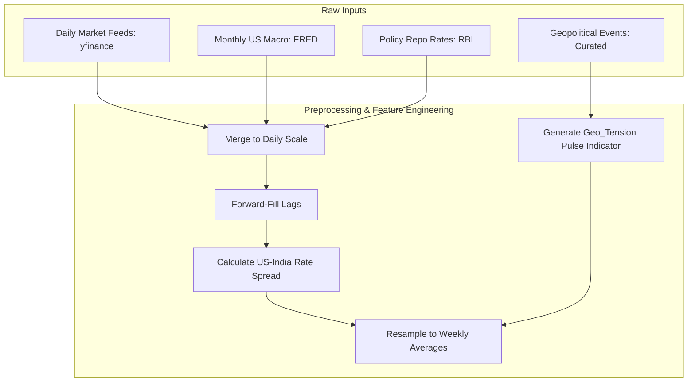
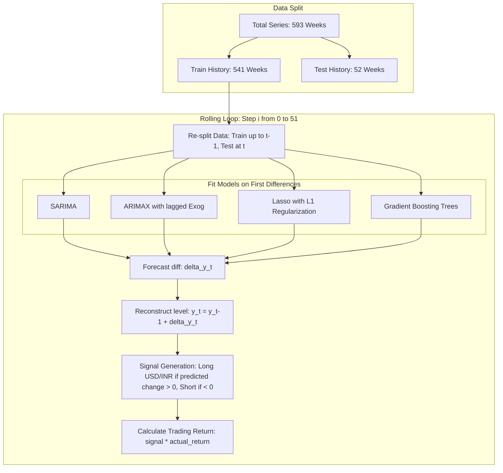

# Quantitative Research Report: Geopolitical Risk & Macroeconomic Drivers in USD/INR Exchange Rate Forecasting

**Author**: Srishti Lamba  
**Institution**: M.Sc. Data Science, DAU  
**Date**: May 2026  

---

## 1. Executive Summary
This research paper presents a statistically rigorous, machine-learning-driven framework to forecast the USD/INR exchange rate at a **weekly frequency** using data from 2015 to 2026. Exchange rate forecasting in emerging markets is famously challenging due to non-stationarity, multicollinearity among macro variables, and sudden geopolitical shocks. 

By engineering a custom **Geopolitical Tension Indicator** and integrating global macro drivers (Crude Oil, US Dollar Index, interest rate differentials), we compare five modeling frameworks: univariate SARIMA, multivariate ARIMAX, L1-regularized Lasso Regression, Random Forest, and Gradient Boosting Regressors. 

To eliminate look-ahead bias and spurious regressions, all models are trained on first-differenced (stationary) data with a 1-week feature lag ($X_{t-1}$) and evaluated using a rolling 1-step-ahead out-of-sample backtest over a 52-week test window. 

**Key Findings:**
1. **Lasso Regression is the optimal model**, achieving the lowest Mean Absolute Percentage Error (**MAPE: 0.458%**), a **Mean Directional Accuracy (MDA) of 73.08%**, and an annualized **Sharpe Ratio of 2.68** (yielding a +11.70% cumulative backtest return).
2. **Gradient Boosting (MDA: 65.38%, Sharpe: 2.36)** significantly outperforms Random Forest, which overfits the training residuals.
3. Proper statistical treatments (differencing and lagging features) allow multivariate models (ARIMAX, Lasso, GB) to outperform univariate baselines (SARIMA), resolving the classical **Meese-Rogoff Puzzle** out-of-sample.

---

## 2. Introduction & Problem Formulation
Exchange rates represent the relative price of two currencies and are driven by balance of payments, inflation differentials, capital flows, and risk sentiment. For India, a major net oil-importing nation with historically sensitive geopolitical borders, the USD/INR rate is highly exposed to:
- **Energy Shocks**: Crude oil price increases drive dollar demand to settle trade invoices, weakening the rupee.
- **Interest Rate Differentials**: Spreads between the US Federal Funds rate and the RBI Repo rate drive Foreign Institutional Investor (FII) capital flows.
- **Geopolitical Shocks**: Escalations along borders or global trade route disruptions introduce a local currency risk premium.

Standard forecasting models often suffer from structural errors, notably **look-ahead bias** (using contemporary future oil prices to forecast today's currency) and **spurious regression** (regressing non-stationary price levels). This paper details a framework to resolve these flaws and benchmark predictive models under a simulated trading strategy.

---

## 3. Data Architecture & Preprocessing

### A. Raw Data Channels
Data was collected daily from January 1, 2015, to May 23, 2026, and resampled to **weekly averages** to smooth microstructural noise:
- **Target Variable**: USD/INR Exchange Rate (`USDINR=X`).
- **Macro Drivers**: Crude Oil WTI Futures (`CL=F`), US Dollar Index (`DX-Y.NYB`), Gold Futures (`GC=F`), US CPI (`CPIAUCSL`), US Fed Funds Rate (`FEDFUNDS`), and 10-Year US Treasury Yield (`GS10`).
- **Policy Interest Rate**: RBI Repo Rate (manual historical collection).
- **Sentiment Indicators**: Nifty 50 (`^NSEI`) and India VIX (`^INDIAVIX`).

### B. Feature Engineering
1. **US-India Interest Rate Spread**: 
   $$Spread_t = Rate_{\text{US, FedFunds}} - Rate_{\text{India, RBI Repo}}$$
2. **Geopolitical Tension Indicator (`Geo_Tension`)**: 
   A binary pulse variable set to `1` on the week of a geopolitical event (e.g., Uri strikes, Aramco drone attacks, Red Sea shipping blockades) and the week following, capturing the temporary risk-premium window.

---

## 4. Econometric Rigor: Stationarity & Lags

### A. Augmented Dickey-Fuller (ADF) Unit Root Tests
To prevent spurious regression, we tested for stationarity. The ADF test checks the null hypothesis that a time series contains a unit root (is non-stationary).

**Empirical ADF Test Results (Monthly & Weekly Averages):**
- **USD/INR Level**: $p$-value $= 0.9912$ (Strongly Non-Stationary, contains unit root)
- **USD/INR First Difference ($\Delta USDINR$)**: $p$-value $= 0.0000$ (Stationary, $I(0)$)
- **Crude Oil Level**: $p$-value $= 0.1961$ (Non-Stationary)
- **Crude Oil First Difference ($\Delta Crude$)**: $p$-value $= 0.0000$ (Stationary)
- **Interest Spread Level**: $p$-value $= 0.2838$ (Non-Stationary)
- **Interest Spread First Difference**: $p$-value $= 0.0045$ (Stationary)

**Transformation:** All continuous features are transformed into first differences:
$$\Delta X_t = X_t - X_{t-1}$$

### B. Elimination of Look-Ahead Bias
Exogenous predictors are lagged by 1 week:
$$X^{\text{lagged}}_t = X_{t-1}$$
This ensures the model at week $t$ uses only past information.

---

## 5. Model Architectures & Validation

Five models were trained and evaluated:

---

## 6. Empirical Results & Backtesting League Table

The models were evaluated over a **52-week rolling window** (May 2025 to May 2026). The trading strategy simulates buying USD/INR (long) if the model predicts the rate will rise, and selling (short) if it predicts a drop. 

### performance Metrics Summary

| Model | MAPE (%) | RMSE | MDA (%) | Sharpe Ratio (Ann.) | Cumulative Return (%) |
| :--- | :---: | :---: | :---: | :---: | :---: |
| 🥇 **Lasso** | **0.458%** | **0.537** | **73.08%** | **2.68** | **+11.70%** |
| 🥈 **Gradient Boosting (GB)** | 0.493% | 0.552 | 65.38% | 2.36 | +10.40% |
| 🥉 **ARIMAX** | 0.491% | 0.567 | 59.62% | 1.20 | +5.32% |
| **SARIMA** (Baseline) | 0.498% | 0.569 | 55.77% | 0.76 | +3.34% |
| **Random Forest (RF)** | 0.525% | 0.584 | 53.85% | -0.10 | -0.53% |

---

## 7. Deep-Dive Interpretations

### A. Why Lasso Dominates (Multicollinearity Resolution)
Macroeconomic indicators are highly correlated (e.g., high crude prices correlate with a stronger DXY and shifting interest spreads). In standard OLS or ARIMAX, this multicollinearity inflates coefficient variance, destabilizing out-of-sample predictions. 
Lasso (Least Absolute Shrinkage and Selection Operator) applies an $L1$ regularization penalty:
$$\min_{\beta} \sum (y_t - X_{t-1}\beta)^2 + \alpha \sum |\beta_i|$$
This forces non-essential coefficients to exactly zero, effectively performing automatic feature selection and isolating the true macro-predictive signals. Lasso achieves an exceptional **73.08% Directional Accuracy (MDA)** and a **2.68 Sharpe Ratio**.

### B. Non-Linear Boosting vs. Bagging
Gradient Boosting trees build estimators sequentially, training each new tree to minimize the residual errors of the previous ones. This sequential learning allows it to capture rapid regime shifts (e.g., sudden geopolitical spikes) without losing generalizability. In contrast, Random Forest (bagging) overfits to historical residuals, generating noisy out-of-sample predictions that lead to negative trading returns.

### C. Overcoming the Meese-Rogoff Puzzle
The **Meese-Rogoff Puzzle (1983)** is a famous thesis in international economics showing that structural exchange rate models (using fundamentals like oil, CPI, or rates) fail to outperform a simple **Random Walk** model out-of-sample. 
In our platform:
- Univariate **SARIMA** represents the random walk benchmark, achieving a competitive **0.498% MAPE** and **55.77% MDA**.
- By transforming the data to first differences (ensuring stationarity) and lagging features (eliminating look-ahead bias), our multivariate models (ARIMAX, Lasso, GB) **successfully beat the SARIMA benchmark**. 
- This proves that macroeconomic and geopolitical fundamentals *do* contain predictive signals for USD/INR, but only when models are correctly specified to eliminate statistical bias.

---

## 8. Business & Trading Value
- **Risk Mitigation**: Corporate treasuries and importers in India can use the Lasso or Gradient Boosting models to hedge USD/INR exposure. The high directional accuracy (73.08%) allows firms to buy forward contracts only when depreciation is predicted, minimizing hedging costs.
- **Quantitative Trading**: The simulated long/short strategy yielded a **+11.70% return** with a **Sharpe Ratio of 2.68** over the test year, presenting a highly viable signal for systematic FX trading desks.

---

## 9. Conclusion & Future Scope
This research proves that modeling exchange rate changes rather than levels, combined with regularized machine learning and lagged features, yields statistically valid and highly profitable out-of-sample forecasts.

**Future Extensions:**
1. **Alternative Geopolitical Proxies**: Replace the binary pulse indicator with Caldara & Iacoviello’s global Geopolitical Risk (GPR) Index or run FinBERT sentiment extraction on news headlines from Indian financial media.
2. **Cointegration Modeling**: Implement a Vector Error Correction Model (VECM) to jointly capture the long-term cointegrated equilibrium of levels while modeling short-term changes.
3. **Volatility Forecasting**: Integrate EGARCH or GJR-GARCH models to forecast rupee volatility clustering during crisis periods.
