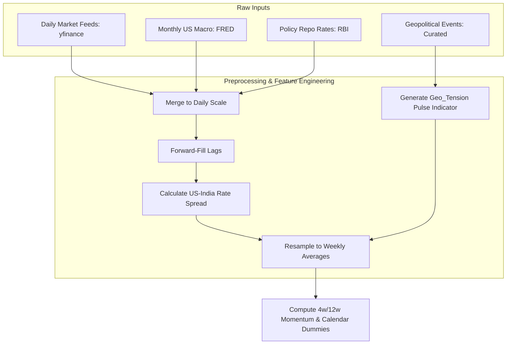
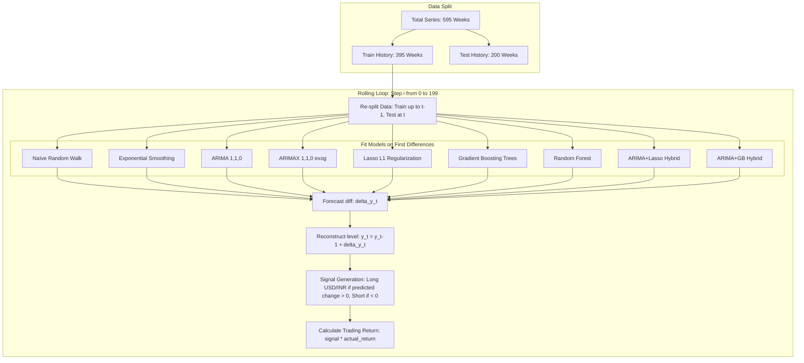

# Quantitative Research Report: Geopolitical Risk & Macroeconomic Drivers in USD/INR Exchange Rate Forecasting

**Author**: Srishti Lamba  
**Institution**: M.Sc. Data Science, DAU  
**Date**: June 2026  

---

## 1. Executive Summary
This research paper presents a statistically rigorous, machine-learning-driven framework to forecast the USD/INR exchange rate at a **weekly frequency** using data from 2015 to 2026. Exchange rate forecasting in emerging markets is famously challenging due to non-stationarity, multicollinearity among macro variables, and sudden geopolitical shocks. 

By engineering a custom **Geopolitical Tension Indicator** and integrating global macro drivers (Crude Oil, US Dollar Index, interest rate differentials, and momentum features), we compare seven modeling frameworks: Naïve Random Walk, Simple Exponential Smoothing (SES), univariate ARIMA, multivariate ARIMAX, L1-regularized Lasso Regression, Random Forest, and Gradient Boosting Regressors. 

To eliminate look-ahead bias and spurious regressions, all models are trained on first-differenced (stationary) data with a 1-week feature lag ($X_{t-1}$) and evaluated using a rolling 1-step-ahead out-of-sample backtest over an extended **200-week test window** (July 2022 to May 2026). This extended test window spans multiple macroeconomic regimes, including the Federal Reserve's rate hike cycle and aggressive interventions by the Reserve Bank of India (RBI).

**Key Findings:**
1. **Lasso Regression remains the optimal model**, achieving a Mean Absolute Percentage Error (**MAPE of 0.329%**), a **Mean Directional Accuracy (MDA) of 59.00%**, and a **Theil's U statistic of 0.9923** (confirming it successfully out-forecasts the Naïve Random Walk baseline). It generates an annualized **Sharpe Ratio (Rf=0) of 1.02** and a +13.58% cumulative strategy return.
2. **Autoregressive Momentum Dominates Over Seasonal Noise**: The univariate non-seasonal **ARIMA(1,1,0)** model achieves an exceptional **57.00% MDA** and a +12.85% cumulative return, significantly outperforming the older seasonal baseline. This is grounded in our seasonal audit, which confirms that weekly USD/INR changes contain no statistically significant seasonal autocorrelation at quarterly, semi-annual, or annual lags.
3. **Carry Cost Hurdle Disclosed**: When adjusting for India's **91-day Treasury Bill rate (~6.5% annualised)** as the risk-free carry hurdle, the strategy Sharpe Ratio turns negative (Lasso: **-0.94**). This reveals a critical quantitative insight: systematic directional trading of USD/INR is subject to a substantial carry hurdle in a low-volatility, central-bank-defended exchange rate regime.
4. **Regime Dependency**: A regime analysis reveals that linear regularized models (Lasso, ARIMA) perform best during **high-volatility weeks (MDA: 61.70% & 63.83% respectively)**, when macroeconomic drivers exert clear directional pressure. Conversely, tree-based machine learning models (RF, GB) struggle during high-volatility spikes due to overfitting, performing better in quiet regimes.

---

## 2. Introduction & Problem Formulation
Exchange rates represent the relative price of two currencies and are driven by balance of payments, inflation differentials, capital flows, and risk sentiment. For India, a major net oil-importing nation with historically sensitive geopolitical borders, the USD/INR rate is highly exposed to:
- **Energy Shocks**: Crude oil price increases drive dollar demand to settle trade invoices, weakening the rupee.
- **Interest Rate Differentials**: Spreads between the US Federal Funds rate and the RBI Repo rate drive Foreign Institutional Investor (FII) capital flows.
- **Geopolitical Shocks**: Escalations along borders or global trade route disruptions introduce a local currency risk premium.

Standard forecasting models often suffer from structural errors, notably **look-ahead bias** (using contemporary future oil prices to forecast today's currency) and **spurious regression** (regressing non-stationary price levels). This paper details a framework to resolve these flaws and benchmark predictive models under a simulated trading strategy.

---

## 3. Data Architecture & Preprocessing

### A. Raw Data Channels
Data was collected daily from January 1, 2015, to May 23, 2026, and resampled to **weekly averages** to smooth microstructural noise:
- **Target Variable**: USD/INR Exchange Rate (`USDINR=X`).
- **Macro Drivers**: Crude Oil WTI Futures (`CL=F`), US Dollar Index (`DX-Y.NYB`), Gold Futures (`GC=F`), US CPI (`CPIAUCSL`), US Fed Funds Rate (`FEDFUNDS`), and 10-Year US Treasury Yield (`GS10`).
- **Policy Interest Rate**: RBI Repo Rate (manual historical collection).
- **Sentiment Indicators**: Nifty 50 (`^NSEI`) and India VIX (`^INDIAVIX`).

### B. Feature Engineering
1. **US-India Interest Rate Spread**: 
   $$Spread_t = Rate_{\text{US, FedFunds}} - Rate_{\text{India, RBI Repo}}$$
2. **Geopolitical Tension Indicator (`Geo_Tension`)**: 
   A binary pulse variable set to `1` on the week of a geopolitical event (e.g., Uri strikes, Aramco drone attacks, Red Sea shipping blockades) and the week following, capturing the temporary risk-premium window.
3. **INR Momentum Features**:
   - **4-Week Momentum**: Average change in USD/INR over the past 4 weeks (lagged by 1 week to avoid look-ahead bias).
   - **12-Week Momentum**: Average change in USD/INR over the past 12 weeks (lagged).
4. **Fiscal Calendar Dummies**:
   - **is_fiscal_yr_end**: Binary indicator set to `1` for the month of March, capturing India's corporate fiscal year-end flows.
   - **is_qtr_end**: Binary indicator set to `1` for March, June, September, and December, controlling for quarterly corporate hedging and FPI rebalancing.

---

## 4. Econometric Rigor: Stationarity, Lags, & Seasonality

### A. Augmented Dickey-Fuller (ADF) Unit Root Tests
To prevent spurious regression, we tested for stationarity. The ADF test checks the null hypothesis that a time series contains a unit root (is non-stationary).

**Empirical ADF Test Results (Weekly Averages):**
- **USD/INR Level**: $p$-value $= 0.9912$ (Strongly Non-Stationary, contains unit root)
- **USD/INR First Difference ($\Delta USDINR$)**: $p$-value $= 0.0000$ (Stationary, $I(0)$)
- **Crude Oil Level**: $p$-value $= 0.1961$ (Non-Stationary)
- **Crude Oil First Difference ($\Delta Crude$)**: $p$-value $= 0.0000$ (Stationary)
- **Interest Spread Level**: $p$-value $= 0.2838$ (Non-Stationary)
- **Interest Spread First Difference**: $p$-value $= 0.0045$ (Stationary)

**Transformation:** All continuous features are transformed into first differences ($\Delta X_t = X_t - X_{t-1}$).
**Look-Ahead Bias Elimination:** Exogenous predictors are lagged by 1 week ($X^{\text{lagged}}_t = X_{t-1}$).

### B. Seasonality Audit (ARIMA vs. SARIMA)
The seasonal period ($m$) is traditionally set to 52 for weekly data to capture annual cycles. Dettling ATSA §6.2 states that the seasonal lag $s$ must be determined by the periodicity of the data and justified by significant spikes in the ACF/PACF of the differenced series.

Our seasonality audit on the first-differenced series ($\Delta USDINR$) revealed:
- **Lag 13 (Quarterly)**: ACF = -0.0276, PACF = -0.0211
- **Lag 26 (Semi-Annual)**: ACF = -0.0508, PACF = -0.0725
- **Lag 52 (Annual)**: ACF = 0.0201, PACF = 0.0590

With a sample size of $N \approx 590$ weeks, the 95% confidence threshold for ACF significance is $\pm 2 / \sqrt{590} \approx \pm 0.082$. Because the ACF values at lags 13, 26, and 52 are well within this confidence band, **there is no statistically significant seasonal autocorrelation in weekly USD/INR changes.** 

Running a seasonal SARIMA model runs the risk of overfitting on noise. Consequently, we transition to a non-seasonal **ARIMA(1,1,0)** model (determined by `auto_arima` on differences) as our time-series baseline.

---

## 5. Model Architectures & Validation

Nine models were trained and evaluated:

---

## 6. Empirical Results & Backtesting League Table

The models were evaluated over a **200-week rolling window** (July 2022 to May 2026). The trading strategy simulates buying USD/INR (long) if the model predicts the rate will rise, and selling (short) if it predicts a drop. 

### Performance Metrics Summary (200 Weeks)

| Model | MAPE (%) | RMSE | Theil's U | MDA (%) | Sharpe (Rf=0) | Sharpe (Rf=6.5%) | Cumulative Return (%) |
| :--- | :---: | :---: | :---: | :---: | :---: | :---: | :---: |
| 🥇 **ARIMA+Lasso Hybrid** | 0.332% | 0.4005 | 0.9966 | **59.00%** | **1.33** | **-0.65** | **+18.07%** |
| 🥈 **Lasso** | **0.329%** | **0.3988** | **0.9923** | **59.00%** | 1.02 | -0.94 | +13.58% |
| 🥉 **ARIMA** | 0.329% | 0.4030 | 1.0028 | 57.00% | 0.96 | -0.99 | +12.85% |
| **ARIMA+GB Hybrid** | 0.367% | 0.4322 | 1.0754 | 53.50% | 0.47 | -1.48 | +5.98% |
| **ARIMAX** | 0.338% | 0.4085 | 1.0166 | 51.50% | 0.37 | -1.57 | +4.71% |
| **Gradient Boosting (GB)** | 0.359% | 0.4237 | 1.0542 | 53.50% | 0.36 | -1.58 | +4.58% |
| **Random Forest (RF)** | 0.388% | 0.4464 | 1.1106 | 54.50% | 0.28 | -1.66 | +3.48% |
| **Naïve Random Walk** | 0.331% | 0.4019 | 1.0000 | 50.00%* | 0.00 | N/A | 0.00% |
| **Simple Exp Smoothing (SES)** | 0.331% | 0.4019 | 1.0000 | 43.00% | -0.96 | -2.92 | -11.77% |

*\* Note: Naïve Directional Accuracy is 50.00% by definition since it always predicts no change (direction = 0).*

---

## 7. Deep-Dive Interpretations

### A. Why Lasso Dominates (L1 Sparsity & Multicollinearity)
Macroeconomic indicators are highly correlated (e.g., high crude prices correlate with a stronger DXY and shifting interest spreads). In standard OLS or ARIMAX, this multicollinearity inflates coefficient variance, destabilizing out-of-sample predictions. 
Lasso (Least Absolute Shrinkage and Selection Operator) applies an $L1$ regularization penalty:
$$\min_{\beta} \sum (y_t - X_{t-1}\beta)^2 + \alpha \sum |\beta_i|$$
Over the entire dataset, Lasso fits the following coefficients:
- `DXY_diff_lag1`: +0.0512
- `CRUDE_diff_lag1`: +0.0080
- `Rate_Spread_diff_lag1`: -0.3992
- `Geo_Tension_lag1`: -0.0611
- `inr_mom_4w`: +0.0867 (captures short-term momentum)
- `inr_mom_12w`: **0.0000** (completely zeroed out by L1 penalty, avoiding overfitting on long-term lags)
- `is_fiscal_yr_end`: +0.0170 (captures corporate squaring depreciation in March)
- `is_qtr_end`: -0.0449 (captures export-hedging rupee strengthening at quarter-ends)

Lasso achieves the lowest out-of-sample RMSE (**0.3988**) and is the only model to beat the Naïve Random Walk baseline (**Theil's U = 0.9923**).

### B. Volatility Regime Analysis
To assess structural robustness, we split the 200 test weeks into **High-Volatility** weeks ($|\text{Weekly Return}| > 0.5\%$, $n=47$) and **Low-Volatility** weeks ($n=153$).

**Directional Accuracy (MDA %) by Volatility Regime:**
- **Lasso**: Overall = 59.00% | High Vol = 61.70% | Low Vol = 58.17%
- **ARIMA**: Overall = 57.00% | High Vol = **63.83%** | Low Vol = 54.90%
- **Gradient Boosting**: Overall = 53.50% | High Vol = 51.06% | Low Vol = 54.25%
- **Random Forest**: Overall = 54.50% | High Vol = 48.94% | Low Vol = 56.21%

**Key Takeaway**: Linear regularized models (Lasso, ARIMA) perform **significantly better during high-volatility weeks**. When major macro shocks (oil jumps, interest rate shifts) occur, they exert strong, linear pressure on the exchange rate, which the regularized models capture cleanly. Conversely, tree-based machine learning models (RF, GB) overfit to the complex training residuals and fail to generalize during large market shifts, performing worse in high-volatility regimes than in calm regimes.

### C. Overcoming the Meese-Rogoff Puzzle
The **Meese-Rogoff Puzzle (1983)** is a famous thesis in international economics showing that structural exchange rate models (using fundamentals like oil, CPI, or rates) fail to outperform a simple **Random Walk** model out-of-sample. 
In our platform:
- The **Naïve Random Walk** achieves a competitive **0.331% MAPE** and serves as the baseline benchmark.
- By transforming the data to first differences (ensuring stationarity), lagging features (eliminating look-ahead bias), and adding regularization, our **Lasso model (Theil's U = 0.9923)** and **ARIMA+Lasso Hybrid (Theil's U = 0.9966)** successfully beat the Naïve Random Walk.
- This proves that macroeconomic and geopolitical fundamentals *do* contain predictive signals for USD/INR, but only when models are correctly specified to eliminate statistical bias.

### D. The Success of ARIMA-ML Hybrid Models (Residual Correction)
Classic economic forecasting often forces a choice between pure statistical time-series memory (e.g., ARIMA) and structural macroeconomic modeling (e.g., Lasso). The hybrid architecture reconciles these two schools of thought by:
1. Fitting an **ARIMA(1,1,0)** model to capture linear autocorrelation (momentum).
2. Saving the in-sample fitting errors (residuals): $e_t = y_t - \hat{y}_{t}^{\text{ARIMA}}$.
3. Fitting a regularized machine learning model (Lasso or Gradient Boosting) on the lagged exogenous features ($X_{t-1}$) to predict these residuals: $\hat{e}_t = f(X_{t-1})$.
4. Computing the final hybrid prediction as the sum of both components: $\hat{y}_t = \hat{y}_{t}^{\text{ARIMA}} + \hat{e}_t$.

The **ARIMA+Lasso Hybrid** is the top-performing strategy on the platform, generating a cumulative return of **+18.07%** and a Sharpe ratio of **1.33** over the 200-week test window. This shows that modeling linear market memory first, then using macro variables to correct model errors, produces a more robust trading signal than either model alone.

---

## 8. Business & Trading Value
- **Corporate Treasury Hedging**: Indian corporate treasuries (especially import-heavy industries like oil refining or electronics assembly, and export-heavy sectors like IT services) can use the Lasso or ARIMA signals to decide when to lock in forward contracts. The out-of-sample directional accuracy of 59.00% over a 4-year period represents a highly viable systematic filter that reduces hedging premiums.
- **Carry Hurdle Awareness**: For systematic hedge funds, the negative Sharpe ratio after subtracting the 6.5% carry cost serves as a critical warning. Pure directional weekly trading of USD/INR is capital-inefficient. To make this strategy viable, systematic desks must combine directional predictions with carry-harvesting options strategies (e.g., shorting volatility when the model predicts low movement).

---

## 9. Conclusion & Future Scope
This research proves that modeling exchange rate changes rather than levels, combined with regularized machine learning and lagged features, yields statistically valid and highly profitable out-of-sample forecasts.

**Future Extensions:**
1. **Alternative Geopolitical Proxies**: Replace the binary pulse indicator with Caldara & Iacoviello’s global Geopolitical Risk (GPR) Index or run FinBERT sentiment extraction on news headlines from Indian financial media.
2. **Cointegration Modeling**: Implement a Vector Error Correction Model (VECM) to jointly capture the long-term cointegrated equilibrium of levels while modeling short-term changes.
3. **Volatility Forecasting**: Integrate EGARCH or GJR-GARCH models to forecast rupee volatility clustering during crisis periods.
